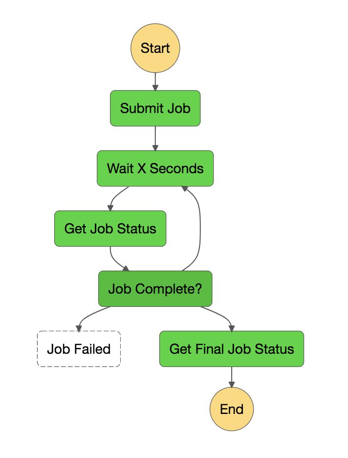

# Transcript generator for the [No Agenda](http://www.noagendashow.com/) show

1. Upload a mp3 file to the S3 bucket under /shows/{showNum}/{filename}
 - the lambda `StartTranscription` is triggered
    - Using ffmpeg split the file into smaller chucks for processing (AWS has a 2 hour limit)
    - upload the chunks to /splits/{showNum}/out-###.mp3
    - call the `startTranscriptionJob` lambda
 - The `TranscriptBuilder ` state machine is kicked off
    - Start the jobs in parallel, one job per file
    - wait 33 seconds
    - check for completion
    - Loop until done
    - When done, call the `getTranscript` lambda and build the output file
    - write JSON to S3
    
The state machine is based on the AWS Job Status Poller sample
    
 
 
Project uses: 
 - [AWS Transcribe](https://aws.amazon.com/transcribe/)
 - [AWS Step Functions](https://aws.amazon.com/step-functions/)
 - [AWS SAM Templates](https://github.com/awslabs/serverless-application-model)
 - [Typescript](https://www.typescriptlang.org/)
 - [Rollup](https://rollupjs.org/)
  

This is a rough initial checkin.

## ToDo
- [ ] Split out StartTranscription into another template since, the step functions don't need ffmpeg
- [ ] Create typescript interface for the step function payload
- [ ] Improve testing
- [ ] Build out error handling and retry logic
- [ ] Send email on completion of job
- [ ] Put an HTTP endpoint to transform the json into HTML or Text for publication
- [ ] Build a UI to upload episodes OR poll RSS for new ones
- [ ] Add timestamps to text and link to player

